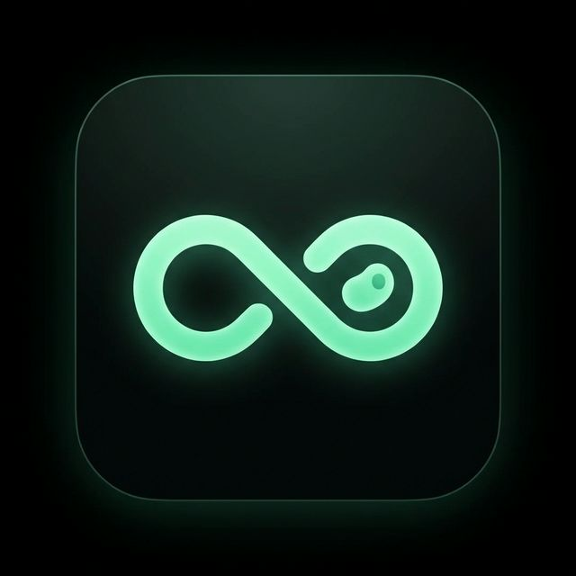

<div align="center">
  
  <h1>HealthAI</h1>
  <p><strong>Your Personal, Private, AI-Powered Health & Fitness Companion</strong></p>
</div>

---

**HealthAI** isn't just another fitness tracker. It's an intelligent, privacy-first health ecosystem built natively for Android & iOS. By combining cutting-edge on-device AI (Google Gemma) with seamless health data integration, HealthAI acts as your personal nutritionist, fitness coach, and wellness advisor—all right in your pocket.

## ✨ Why Choose HealthAI?
Unlike traditional health apps that rely on manual logging and generic advice, HealthAI learns from your habits, understands your goals, and provides hyper-personalized actionable insights. **What makes us unique?**

🔒 **Total Privacy with On-Device AI**
We believe your health data is yours. HealthAI leverages **Google Gemma**, running entirely *offline* and *on-device*. No cloud servers snooping on your chats, no latency, just private, intelligent conversations.

📸 **Instant AI Diet Scanning**
Point your camera at a meal or scan a barcode. HealthAI instantly analyzes nutritional content, breaks down macros, and logs it seamlessly.

📊 **Smart Health Integration**
Syncs effortlessly with Google Fit and Apple Health. HealthAI automatically pulls your steps, activity rings, and metrics to give the AI context on your exact physical state before giving advice.

💬 **Context-Aware Coaching**
Chat with your AI coach anytime. Because it has access to your logged meals and live activity data, it doesn't give generic advice. It gives *you* advice. *(e.g. "I see you're 200 calories under your goal and haven't worked out yet. How about a 20-minute HIIT session and a protein shake?")*

## 🚀 Key Features
*   **Hero Activity Dashboard:** Beautiful, animated activity rings tracking your daily goals.
*   **Intelligent Meal Scanner:** Computer vision and barcode scanning for frictionless calorie counting.
*   **Personalized Workout Programs:** Tailored routines that adapt to your progress.
*   **Rich Local Database:** Powered by Isar for blazing-fast, offline-first data storage.
*   **Dynamic Theming:** Handcrafted light and dark modes with modern aesthetics.
*   **Local Notifications:** Smart reminders to hydrate, move, or take supplements.

## 🛠️ Tech Stack
*   **Framework:** Flutter (Dart)
*   **Local AI Engine:** `flutter_gemma` (On-Device LLMs)
*   **Cloud AI Fallback:** `google_generative_ai` (Gemini API)
*   **Database:** Isar (NoSQL)
*   **State Management:** Riverpod
*   **Routing:** GoRouter
*   **Health Sync:** `health` package

## 🚀 Getting Started

### Prerequisites
*   Flutter SDK `^3.0.0`
*   A physical Android or iOS device (On-device AI requires physical hardware, not emulators).

### Installation
1. Clone the repository:
   ```bash
   git clone https://github.com/coded-with-aryan0426/HealthAI_Fluter_app.git
   ```
2. Fetch dependencies:
   ```bash
   flutter pub get
   ```
3. Set up your `.env` file in the project root:
   ```env
   # Required for downloading gated HuggingFace models
   HF_TOKEN=your_token_here
   ```
4. Run the app:
   ```bash
   flutter run
   ```

## 🔒 Privacy & Security First
HealthAI is designed from the ground up to respect your data. Your chat history, health metrics, and personal profile never leave your device unless you explicitly choose to export them. Local AI models guarantee that your coaching sessions remain completely confidential.

---
<div align="center">
  <i>Empower your health journey. Build better habits. Stay private.</i>
</div>
